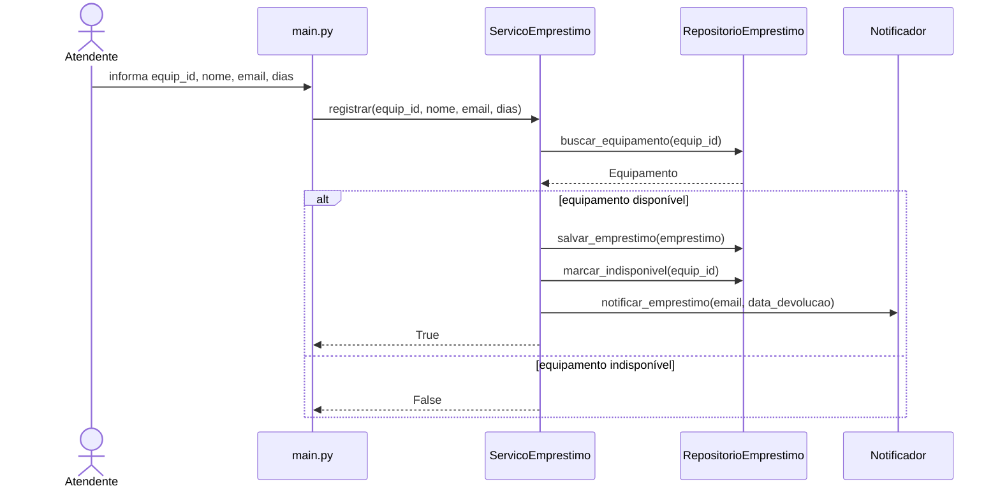
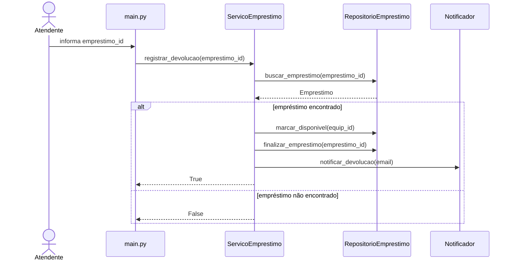
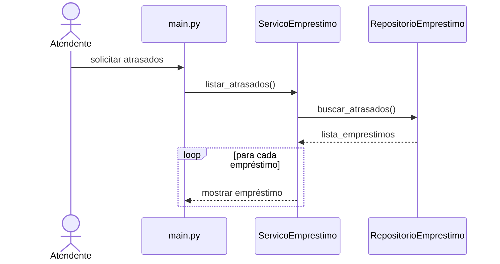

# Diagramas e Decomposição do Projeto

## Decomposição em camadas

### models/
- Equipamento: representa os equipamentos do sistema e concentra apenas os dados do domínio.
- Emprestimo: representa um empréstimo realizado no sistema.

### services/
- ServicoEmprestimo: concentra as regras de negócio relacionadas aos empréstimos.
- Notificador: responsável apenas pelo envio de notificações.

### repositories/
- RepositorioEmprestimo: responsável pelo acesso e armazenamento dos dados.

### main.py
- Responsável pela interação com o usuário via terminal.

## Diagramas de sequência

### UC01 — Registrar Empréstimo

### UC02 — Registrar Devolução

### UC03 — Listar Empréstimos em Atraso

